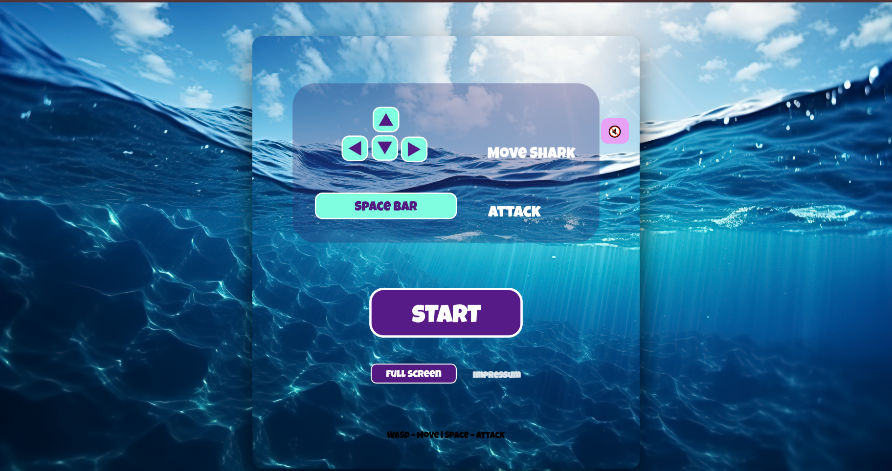
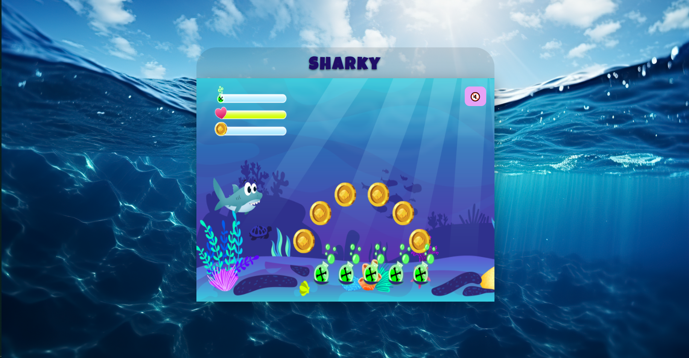

# Sharky – Underwater Adventure 🦈

A 2D browser game built with JavaScript and HTML5 Canvas.

## Features
- Character movement (keyboard + mobile controls)
- Bubble attack & Fin slap attack
- Different enemy types (Jellyfish, Pufferfish)
- Endboss fight
- Sound system (music + effects)
- Game Over & Win screens
- Responsive design (mobile + desktop)

## Controls
- Arrow Keys / WASD → Move
- Space → Fin attack
- A → Bubble attack

## How to run
Just open index.html in your browser.

## Tech Stack
- JavaScript (Vanilla)
- HTML5 Canvas
- CSS

## Note
This project was developed for educational purposes as part of a programming course.

## Author
Sonja Reimann-Thanisch